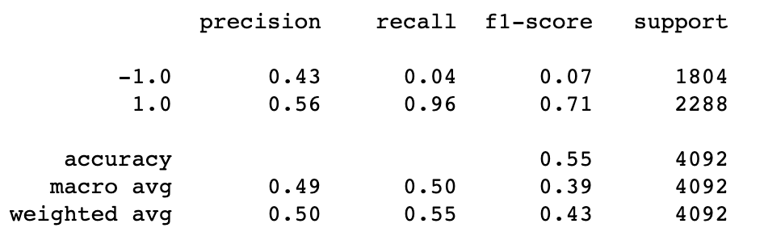
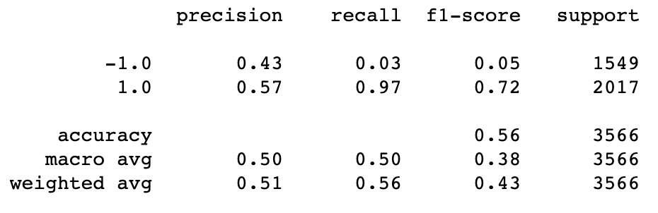
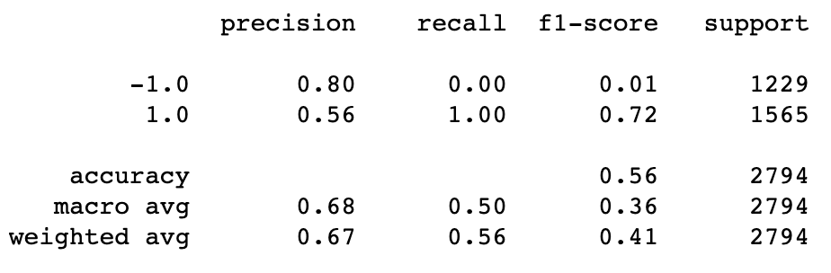
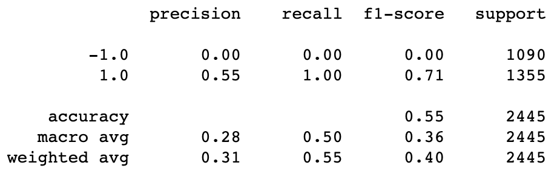
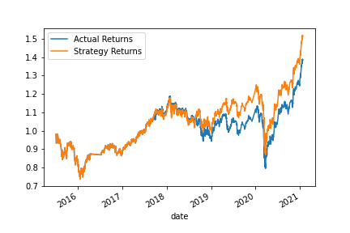

# Machine Learning Trading

>The notebook includes trading strategy testing using machine learning. The model has been tested by adjusment of months and SMA window
* [3 Month Performance](#3-month-performance)
* [10 Month Performance](#10-month-performance)
* [24 Month Performance](#24-month-performance)
* [50-200 SMA Performance](#50-200-sma-performance)
* [Conclusion](#conclusion)

---

## Technologies

Python version 3.9 
* [pandas](https://pandas.pydata.org/)
* [sklearn](https://scikit-learn.org/stable/)
* [hvplot](https://hvplot.holoviz.org/index.html)

---

## Installation Guide

```python
pip install pandas
pip install sklearn
pip install hvplot
```

---

## 3 Month Performance

## 10 Month Performance

## 24 Month Performance

## 50-200 SMA Performance


---

## Conclusion

Looking at the performance of all adjusments, adjusting to model to test a 10 month and 24 month window has improved the accuracy. The problem with both the 10 month and 24 month strategy is that their expected returns are lower than the actual returns. The 50-200 SMA window has the same accuracy as the 3 month strategy but its expected return is the exact same as the actual returns. The 3 month strategy has higher expected returns than all other strategies and include the actual returns. 
### 3 Month Strategy


---

## Contributors

Main contributer **Santiago Hernandez**
- [dsmannight@gmail.com](dsmannight@gmail.com)

---

## License

This application is free for non-profit use.
